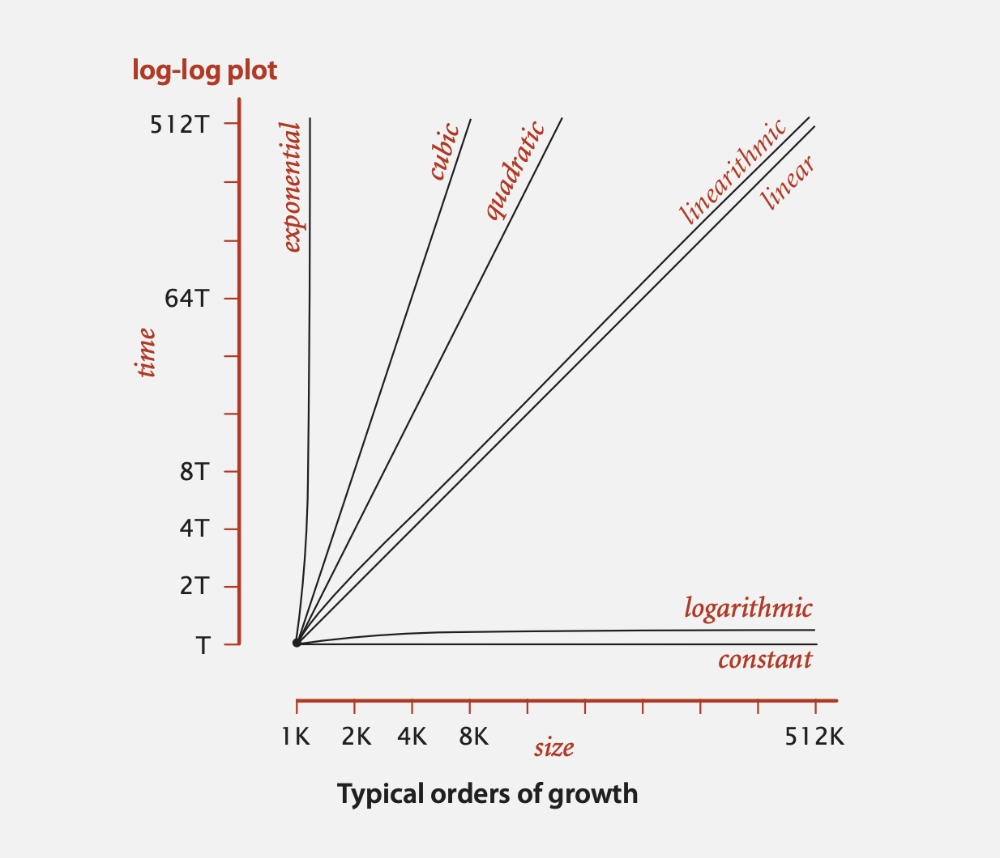

# Analysis of algorithmsfun
Discrete Fourier transform
N-body simulation

* Quadratic
* Linearithmic
* Linear

### Scientific method applied to analysis of algorithms
* Observe
* Hypothesize
* Predict
* Verify
* Validate

### Princibles
* Experiments must be reproducible
* Hypotheses must be falsifiable

## Observations
## Mathematical Models
`Total running time` sum of cost x frequency for all operations (needs to analyze program)
* Cost depends on machine, compiler
* Frequency depends on algorithm, input data

## Order-of-growth classifications
* constant (1)
* logarithmic (log N, binary search)
* linear (N, find the maximum)
* linearithmic (N log N, mergesort)
* quadratic (N^2, check all pairs)
* cubic (N^3, check all triples)
* exponential (2^N, check all subsets)

Sorting based algorithm for 3-Sum problem:
Sort the input array and then for each pair of numbers make a binary search to find the third number. Which value is negative of sum first two numbers.

## Theory of algorithms
* `Lower bound` - Best case
* `Upper bound` - Worst case
* Tilde (`~`) - provide approximate model
* Big Theta (`Big Θ`) notation - classify algorithms
* Big Oh (`Big O`) notation - upper bounds
* Big Omega (`Big Ω`) notation - lower bounds

### Algorithm design approach
Start
* Develop an algorithm.
* Prove a lower bound.

Gap?
* Lower the upper bound (discover a new algorithm).
* Raise the lower bound (more difficult).

## Memory
## Summary
Empirical analysis.
* Execute program to perform experiments.
* Formulate a hypothesis.
* Model enables us to make predictions.

Mathematical analysis.
* Analyze the algoruthm to count frequency of operations.
* Use tilde notaiton to simplify analysis.
* Model enables us to explain behaviour.

Scientific method.
* Mathematical model is independent of a particular system; applies to machines not yet built.
* Empirical analysis is necessary to validate mathematical models and to make predictions.