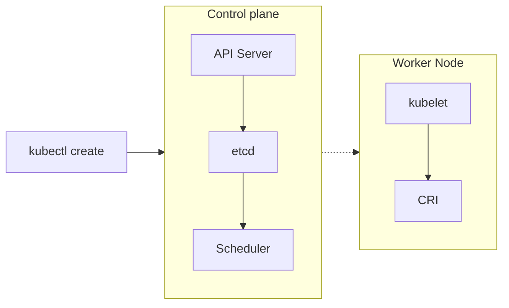

# Scheduler

### Scheduling process



### Setting node preferences

```bash
kubectl get node --show-labels
kubectl label nodes cka-ubuntu-worker-02 disktype=ssd
```

Usage:

```yaml
apiVersion: v1
kind: Pod
metadata:
  name: nginx
spec:
  containers:
    - name: nginx
      image: nginx
      imagePullPolicy: IfNotPresent
  nodeSelector:
    disktype: ssd
```

### Affinity and anti-Affinity rules

```yaml
apiVersion: v1
kind: Pod

metadata:
  name: antinginx

spec:
  affinity:
    nodeAffinity:
      requiredDuringSchedulingIgnoredDuringExecution:
        nodeSelectorTerms:
          - matchExpressions:
              - key: disktype
                operator: NotIn
                values:
                  - ssd

  containers:
    - name: nginx
      image: nginx
      imagePullPolicy: IfNotPresent
```

### Taints and Tolerance

### Namespace Quota

```bash
kubectl create ns limited
kubectl create quota qtest --hard pods=3,cpu=100m,memory=500Mi -n limited
kubectl describe ns limited
kubectl get all -n limited

kubectl create deploy nginx --image=nginx --replicas=3 -n limited
kubectl set resources deploy nginx --requests cpu=100m,memory=5Mi --limits cpu=200m,memory=20Mi -n limited
kubectl get all -n limited

kubectl get quota -n limited
kubectl edit quota -n limited
kubectl scale -n limited deployment nginx --replicas=4
kubectl get all -n limited
```

### LimitRange

```bash
kubectl explain limitrange.spec
kubectl explain limitrange.spec.limits

kubectl apply -f limitrange.yaml -n limitrange
kubectl describe ns limitrange
kubectl run limitpod --image=nginx -n limitrange
kubectl describe pod limitpod -n limitrange
```

### Scheduling Priorities

```bash
kubectl create priorityclass high-priority --value=1000 --description="high priority" --preemption-policy="Never"
kubectl create priorityclass mid-priority --value=125 --description="mid priority" --global-default=true
kubectl run testpod --image=nginx

kubectl create deploy highprio --image=nginx
kubectl edit deploy highprio #       spec.spec.priorityClassName: high-priority
kubectl get pods highprio-9c8f4cfff-w8slv -o yaml | grep -B2 -i priorityclass
```
